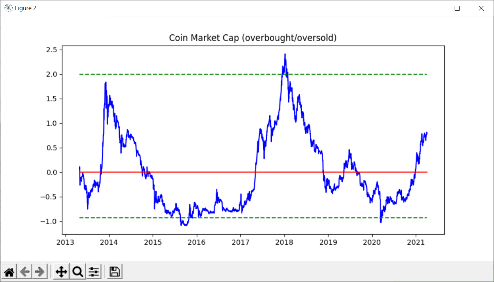

# CoinMarketCap

Performs a polynomial regression analysis on the log transformed market capitalization data of the cryptocurrency sector. Note: data must be updated manually.

Figure 1 shows the market capitalization, the regression curve, and separately calculated upper and lower confidence bands (95% CI). The graph extends for an additional 50% of the historic timeframe. This figure is useful to investors as it shows the long-term trend as well as the chances for upcoming reversals. 

Figure 2 takes the regression curve as a baseline and shows confidence bands and actual market capitalization in relation to the regression curve.

